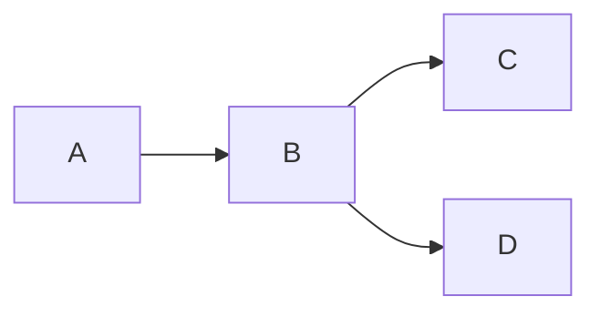
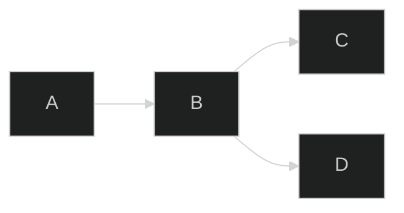

# Welcome to Joplin! 🗒️

Joplin is a free, open source note taking and to-do application, which helps you write and organise your notes, and synchronise them between your devices. The notes are searchable, can be copied, tagged and modified either from the application directly or from your own text editor. The notes are in [Markdown format](https://joplinapp.org/#markdown). Joplin is available as a **💻 desktop**, **📱 mobile** and **🔡 terminal** application.

The notes in this notebook give an overview of what Joplin can do and how to use it. In general, the three applications share roughly the same functionalities; any differences will be clearly indicated.


## Joplin is divided into three parts

Joplin has three main columns:

- **Sidebar** contains the list of your notebooks and tags, as well as the synchronisation status.
- **Note List** contains the current list of notes - either the notes in the currently selected notebook, the notes in the currently selected tag, or search results.
- **Note Editor** is the place where you write your notes. There is a **WYSIWYG editor** and a **Markdown editor** - click on **Code View** to switch between both! You may also use an [external editor](https://joplinapp.org/#external-text-editor) to edit notes. For example you can use something like Typora as an external editor and it will display the note as well as any embedded images.

## Writing notes in Markdown

Markdown is a lightweight markup language with plain text formatting syntax. Joplin supports a [Github-flavoured Markdown syntax](https://joplinapp.org/markdown/) with a few variations and additions.

In general, while Markdown is a markup language, it is meant to be human readable, even without being rendered. This is a simple example (you can see how it looks in the viewer panel):

* * *

# Heading

## Sub-heading

Paragraphs are separated by a blank line. Text attributes _italic_, **bold** and `monospace` are supported. You can create bullet lists:

* apples
* oranges
* pears

Or numbered lists:

1. wash
2. rinse
3. repeat

This is a [link](https://joplinapp.org) and, finally, below is a horizontal rule:

* * *

A lot more is possible including adding code samples, math formulae or checkbox lists - see the [Markdown documentation](https://joplinapp.org/#markdown) for more information.

## Organising your notes

### With notebooks 📔

Joplin notes are organised into a tree of notebooks and sub-notebooks.

- On **desktop**, you can create a notebook by clicking on New Notebook, then you can drag and drop them into other notebooks to organise them as you wish.
- On **mobile**, press the "+" icon and select "New notebook".
- On **terminal**, press `:mn`


### With tags 🏷️

The second way to organise your notes is using tags:

- On **desktop**, right-click on any note in the Note List, and select "Edit tags". You can then add the tags, separating them by commas.
- On **mobile**, open the note and press the "⋮" button and select "Tags".
- On **terminal**, type `:help tag` for the available commands.

### Tables

<div class="calendar">

| Mä. |  Mo. |  Tu. |  We. |  Th. |  Fr. |  Sa. |  Su. |
| --: | ---- | ---- | ---- | ---- | ---- | ---- | ---- |
| #40 | *3* <i>🛋️</i> | *4* | *5* | *6* | *7* <i>🩰</i> | *8* <i>🛒🩰</i> | *9* |
| #41 | *10* <i>🎂</i> | *11* | *12* | *13* <i>🍣</i> | *14* | *15* <i>🥂🩰</i> | *16* |
| #42 | *17* | *18* | *19* <i>🎂</i> | *20* | *21* <i>🍵</i> | *22* <i>🩰</i> | *23* |
| #43 | *24* | *25* | *26* | *27* | *28* | *29* | *30* |
| #44 | *31* <i>🛋️</i> | **1** <i>🌴🎷</i> | **2** <i>🌴</i> | **3** | **4** |  **5** | **6** |
</div>

### Notices

<b-notice>
  <b>NOTICE:</b> This is a notice box
</b-notice>

<b-help>
  <b>HELP:</b> This is a help box
</b-help>

<b-success>
  <b>SUCCESS:</b> This is a success box
</b-success>

<b-warning>
  <b>WARNING:</b> This is a warning box
</b-warning>

<b-error>
  <b>ERROR:</b> This is a error box
</b-error>

<b-construction>
  <b>CONSTRUCTION:</b> This is a construction box.
</b-construction>

### Custom CSS Sample

Aurea prima sata est aetas, quae vindice nullo, sponte sua, sine lege fidem rectumque colebat.

- List item 1
	- List item 1.1

- [ ] Check box 1
	- [ ] Check box 1.1

[Reference to other note](:/00112233445566778899aabbccddeeff)

    Aurea prima sata est aetas, quae vindice nullo,
    sponte sua, sine lege fidem rectumque colebat.

Test **strong** and _italics_ markup. Here's a ==marked== text.

Aurea prima sata est aetas, quae vindice nullo, sponte sua, sine lege fidem rectumque colebat.

Here's the [link](https://github.com/tessus/joplin-custom-css) to my `joplin-custom-css` repo.

#### Mermaid

for better view, you should add code block below:

```
%%{init: { "theme": "dark" } }%%
```

You can see the differences here in the preview mode:





#### Katex

$$
\sigma = \sqrt{\frac 1 N \sum_{i=1}^N(x_i-\bar{x})^2}
$$

#### Code block

```
#include <stdio.h>

int main(int argc, char *argv[])
{
    printf('Test\n');
    return 0;
}
```


